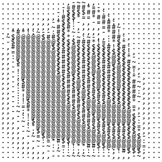

# Pixel-Char: transform an image to a text frame

  
Heavily inspired by donut code

## Usage

Using the binaries at `/bin`
```console
$ pixel-chars.exe <IMAGE_PATH> <RESOLUTION> <white || black> 
```

Using `cargo`
```console
$ cargo run <IMAGE_PATH> <RESOLUTION> <white || black>
```

## How it works

1. Resizes the image to the specified resolution
2. Checks each pixel dim by multiplying red, green and blue
3. Replaces the pixel by a character that has the same dim in order: .,-~:;=!*#$@

## Contributing

1. Clone
2. Create a new branch
3. Commit your changes
4. Send a pull request